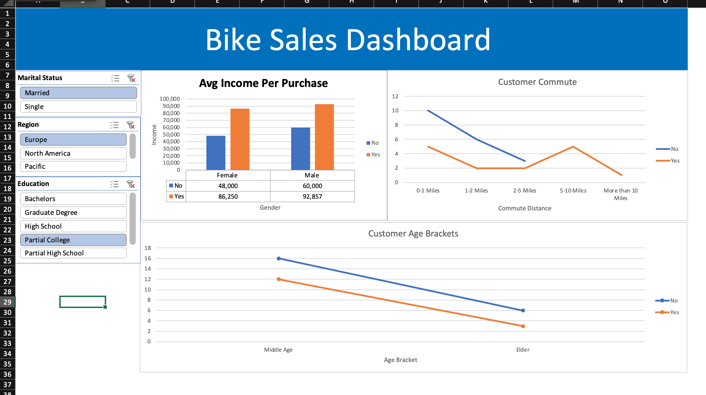

# Data-Cleaning-and-Dashboard-in-Excel

In this project we downloaded a Bike Sales dataset from from this GitHub profile https://github.com/AlexTheAnalyst/Excel-Tutorial/blob/main/Excel%20Project%20Dataset.xls and used it to clean, explore and visualize the data through a final dashboard. Below I've made a step by step description of my process and how I tackled it: 

1. Dowload the dataset as a .xls file. 

2. Open it in Excel and created 3 new sheets in order to have a work organization: Worksheet, Pivot Table, Dashboard. 

3. Copy the whole table from the bike_buyers sheet and Paste it on the Worksheet sheet in order to keep the raw data as it is to avoid issues and mess it up.

4. Apply a filter to every column first, to know the data we’re working with.

5. Check for Duplicates before doing anything → 26 duplicates were removed out of 1000

6. Now we look at the Marital Status and Gender columns and find out that they have many M, F and S repeated, that 

- So we select the whole column B, use ctrl+H to enable the Find and Replace Window
- Search for M → replace for Married (match cases min and mayus)
- There has been 539 replacements
- Do the same with S for → Single and it shows 463 replacements

7. Use Find and Replace on column C 

- Search for F → replace for Female (match cases min and mayus)
- It shows 489 replacements

8. Use Find and Replace on column C 

- Search for M → replace for Male
- It shows 511 replacements

9. Now we check Column D and set the values as “currency” 

10. Rest of columns checked (E-K), nothing changed, though we insert a new column next to L: “column M” renamed as Age Brackets (is really useful to show a more accurate graphic when we do the dashboard)

11. We used IF function to give it a better significance to those age numbers so we build the following function → = IF(L2>54, "Elder", IF(L2>=31, "Middle Age", IF(L2<31, "Young", "Invalid")))

12. Having the information cleaned and wrangled we proceed to analyze through Pivot Tables: 

- Click on cell A3 → Insert Pivot Table → Select range: $A$1:$N$1001
- Pivot Table is ready → Income goes into Values Box (we calculate it as average), Gender goes in Rows Box and Purchased Bikes in column.

It shows the average income of females and males who did and didn’t buy the bikes, and the sum total of those decisions. 

But why are we creating it? 👇🏻

Based on the income obtained from customers

- 1st pivot Table: based on the income obtained from customers the business related question that arise is → Does the income change wether they bought or did not buy the bike? If there’s any reason for that?

13. We proceed to insert a graphic, clicking on Insert and selecting the graph we want:
- Y-axis: Average Income
- X-axis: Gender
- Legend: Purchased Bike (No and Yes)

14. Adjust graphic settings: 
- Name of Axis: Y-axis: Income, X-axis: Gender
- Name of graphic: Avg Income Per Purchase
- Let only two decimals, add thousand separator (,)

15. Create 2nd Pivot Table: based on Commuting Distance → Does the person buying a bike lives miles away or close?

16. Wrangling the Pivot Table Data: Purchased Bike → Value Box and Column Box, Commute Distance → Row Box 

- Found out that the miles aren’t in ascending or descending order so we had to use Find and Replace tool to Find “10 + Miles” and Replace it with “10 Miles +” (didn’t work) → had to change it like this: Find “10 + Miles” and Replace it with “More than 10 Miles” and it works.
- Graphic Title: Customer Commute
- X-Axis title: Commute Distance

17. Create 3rd Pivot Table: based on Age Brackets → how many bikes by age group were sold?

18. Wrangling the Pivot Table Data: Purchased Bike goes to → Value Box (make it a count) and Column Box, Age Brackets goes to → Row Box 

- Sorted the age brackets as Ascending and it shows as: Youth - Middle Age - Elder
- Graphic Title: Customer Age Brackets
- X-Axis title: Age Bracket

19. Building our Dashboard: 

- Copy all the graphics and move them to the Dashboard sheet
- Unmark the gridlines option
- Select a range to add a background color, then Merge & Center → type: Bike Sales Dashboard, make it white color.
- Align them evenly.
- Insert slicer in Pivot Chart Analyzer
- Slicer tab → report connections → connect with other Pivot Tables
- Make 2 other slicers with Region and Education.

